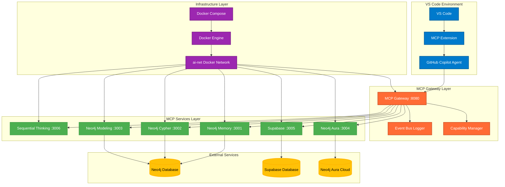
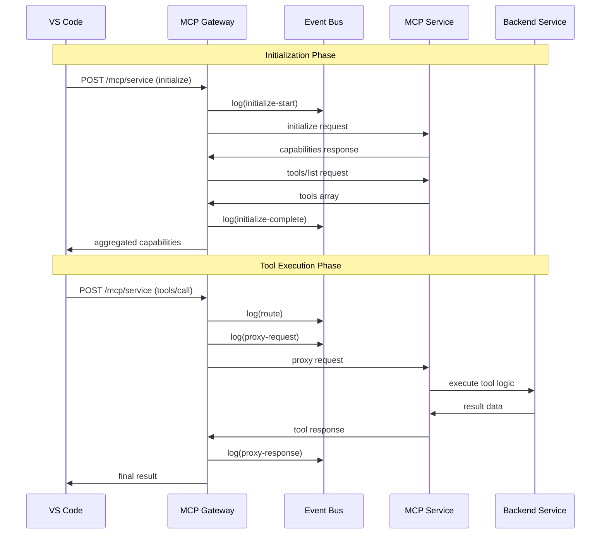
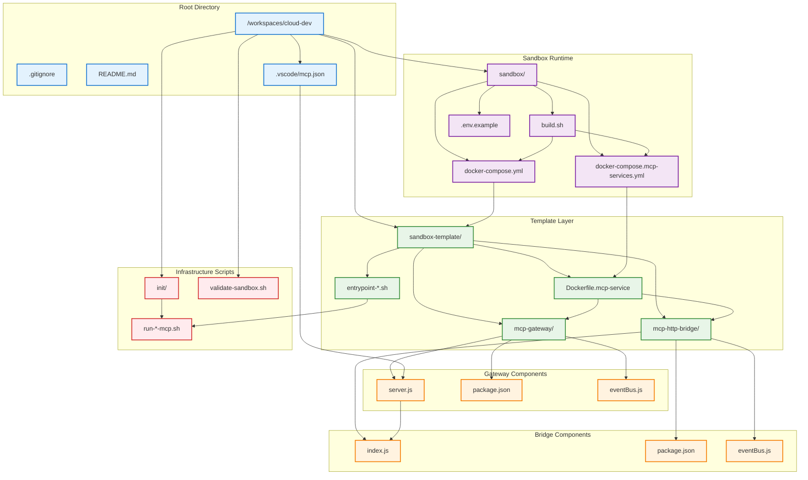
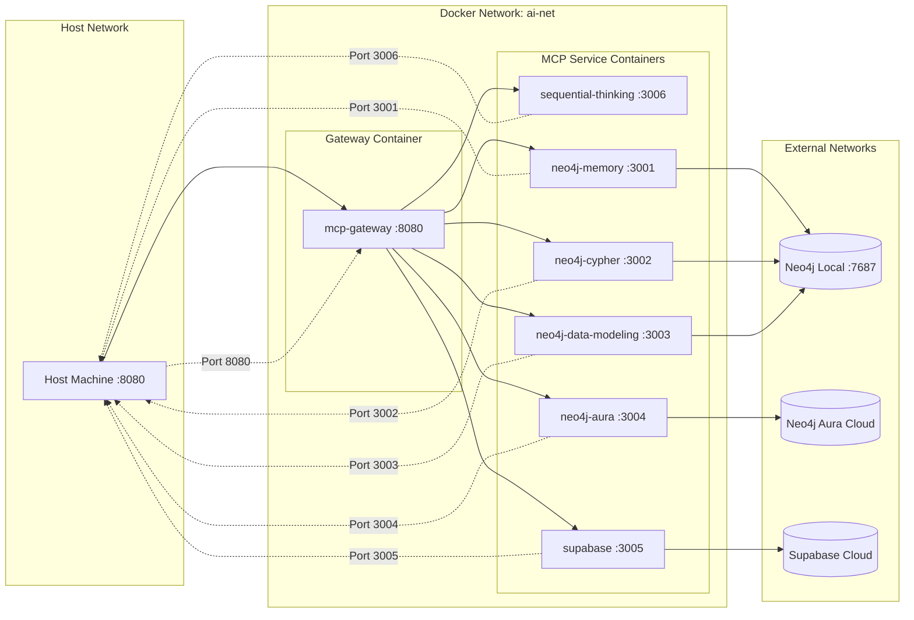
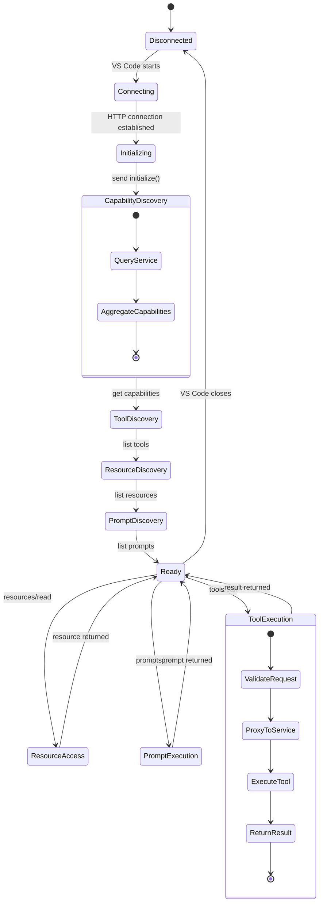
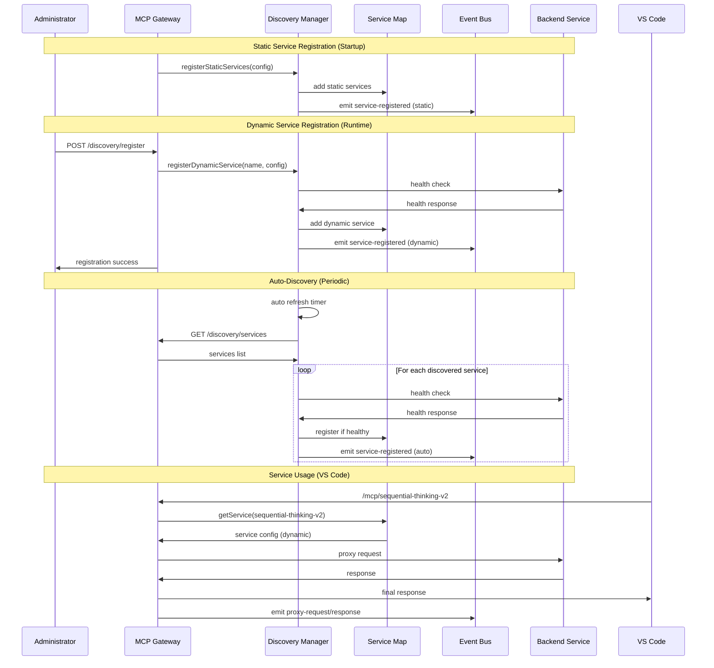
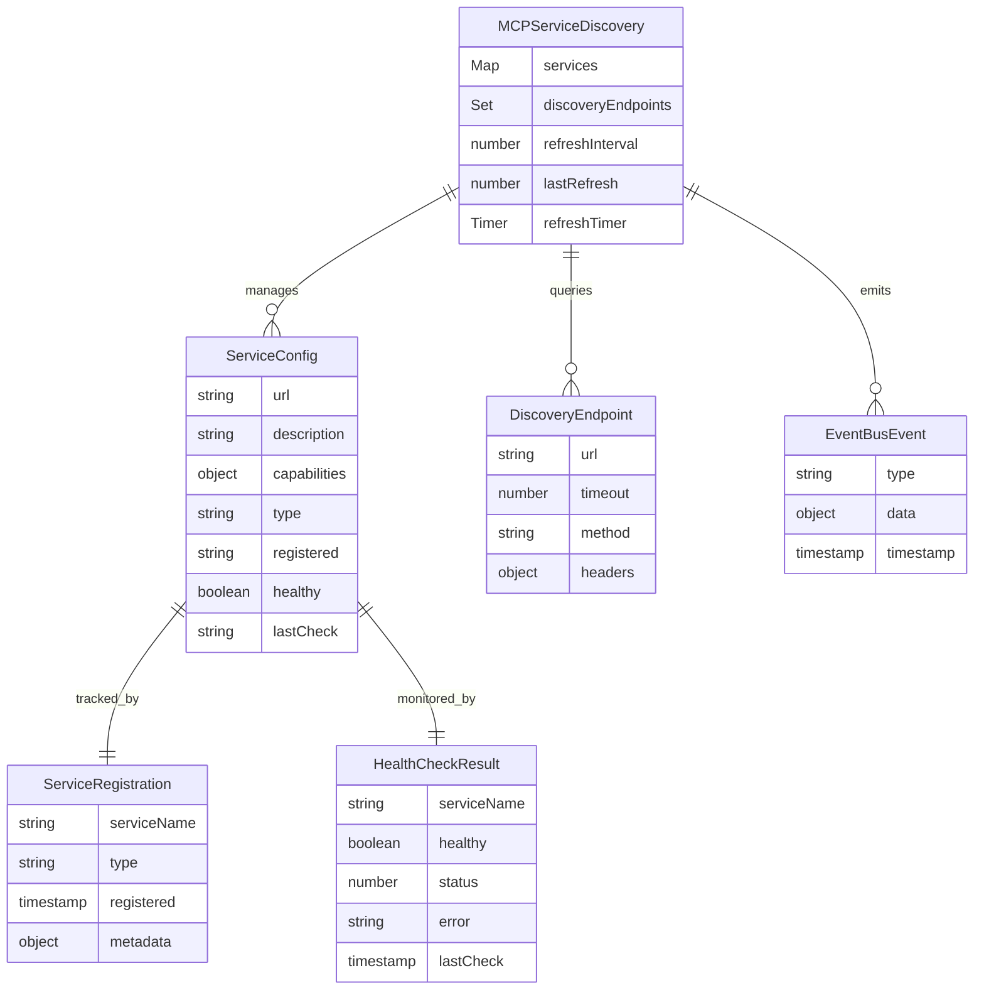

```mermaid
graph TD
    subgraph "Event Sources"
        Gateway[Gateway Server]
        Services[MCP Services]
        VSCode[VS Code Client]
    end
    
    subgraph "Event Bus"
        EventBus[Event Bus Core]
        Listeners[Event Listeners]
        Logger[Console Logger]
    end
    
    subgraph "Event Types"
        Route[route]
        ProxyReq[proxy-request]
        ProxyRes[proxy-response]
        InitStart[initialize-start]
        InitComplete[initialize-complete]
        Error[error]
        Notification[notification]
        Shutdown[shutdown]
    end
    
    subgraph "Event Data"
        ServiceName[serviceName]
        Method[method]
        Params[params]
        ID[id]
        URL[url]
        Result[result]
        Capabilities[capabilities]
        ToolsCount[toolsCount]
        ErrorMsg[error message]
    end
    
    %% Event flow
    Gateway --> EventBus
    Services --> EventBus
    VSCode --> EventBus
    
    EventBus --> Listeners
    Listeners --> Logger
    
    %% Event types
    EventBus --> Route
    EventBus --> ProxyReq
    EventBus --> ProxyRes
    EventBus --> InitStart
    EventBus --> InitComplete
    EventBus --> Error
    EventBus --> Notification
    EventBus --> Shutdown
    
    %% Data attachments
    Route --> ServiceName
    Route --> Method
    Route --> Params
    Route --> ID
    
    ProxyReq --> URL
    ProxyRes --> Result
    InitComplete --> Capabilities
    InitComplete --> ToolsCount
    Error --> ErrorMsg
    
    %% Styling
    classDef source fill:#E3F2FD,stroke:#1976D2,stroke-width:2px
    classDef bus fill:#F3E5F5,stroke:#7B1FA2,stroke-width:2px
    classDef event fill:#E8F5E8,stroke:#388E3C,stroke-width:2px
    classDef data fill:#FFF3E0,stroke:#F57C00,stroke-width:2px
    
    class Gateway,Services,VSCode source
    class EventBus,Listeners,Logger bus
    class Route,ProxyReq,ProxyRes,InitStart,InitComplete,Error,Notification,Shutdown event
    class ServiceName,Method,Params,ID,URL,Result,Capabilities,ToolsCount,ErrorMsg data
```

```mermaid
graph TB
    subgraph "Docker Compose Stack"
        subgraph "Core Services (docker-compose.yml)"
            Neo4jDB[neo4j-db :7687]
            Neo4jDBUI[neo4j-browser :7474]
        end
        
        subgraph "MCP Services (docker-compose.mcp-services.yml)"
            Gateway[mcp-gateway :8080]
            SeqThink[sequential-thinking-service :3006]
            Neo4jMem[neo4j-memory-service :3001]
            Neo4jCypher[neo4j-cypher-service :3002]
            Neo4jModel[neo4j-data-modeling-service :3003]
            Neo4jAura[neo4j-aura-service :3004]
            Supabase[supabase-service :3005]
        end
        
        subgraph "Development Services (docker-compose.dev.yml)"
            AgenticSandbox[agentic-sandbox]
        end
    end
    
    subgraph "Build Dependencies"
        DockerfileMCP[Dockerfile.mcp-service]
        GatewayCode[mcp-gateway/]
        BridgeCode[mcp-http-bridge/]
        Entrypoints[entrypoint-*.sh]
    end
    
    subgraph "Runtime Dependencies"
        EnvFile[.env]
        InitScripts[deps/init/]
        Network[ai-net]
    end
    
    %% Build dependencies
    Gateway --> DockerfileMCP
    SeqThink --> DockerfileMCP
    Neo4jMem --> DockerfileMCP
    Neo4jCypher --> DockerfileMCP
    Neo4jModel --> DockerfileMCP
    Neo4jAura --> DockerfileMCP
    Supabase --> DockerfileMCP
    
    DockerfileMCP --> GatewayCode
    DockerfileMCP --> BridgeCode
    DockerfileMCP --> Entrypoints
    
    %% Runtime dependencies
    Gateway --> EnvFile
    SeqThink --> InitScripts
    Neo4jMem --> InitScripts
    Neo4jCypher --> InitScripts
    Neo4jModel --> InitScripts
    Neo4jAura --> InitScripts
    Supabase --> InitScripts
    
    %% Network dependencies
    Gateway --> Network
    SeqThink --> Network
    Neo4jMem --> Network
    Neo4jCypher --> Network
    Neo4jModel --> Network
    Neo4jAura --> Network
    Supabase --> Network
    Neo4jDB --> Network
    
    %% Service dependencies
    Neo4jMem --> Neo4jDB
    Neo4jCypher --> Neo4jDB
    Neo4jModel --> Neo4jDB
    AgenticSandbox --> Gateway
    
    %% Styling
    classDef core fill:#E3F2FD,stroke:#1976D2,stroke-width:3px
    classDef mcp fill:#F3E5F5,stroke:#7B1FA2,stroke-width:2px
    classDef dev fill:#E8F5E8,stroke:#388E3C,stroke-width:2px
    classDef build fill:#FFF3E0,stroke:#F57C00,stroke-width:2px
    classDef runtime fill:#FFEBEE,stroke:#D32F2F,stroke-width:2px
    
    class Neo4jDB,Neo4jDBUI core
    class Gateway,SeqThink,Neo4jMem,Neo4jCypher,Neo4jModel,Neo4jAura,Supabase mcp
    class AgenticSandbox dev
    class DockerfileMCP,GatewayCode,BridgeCode,Entrypoints build
    class EnvFile,InitScripts,Network runtime
```

# MCP Cloud Sandbox Architecture Diagrams

This document contains comprehensive diagrams showing the structure, dependencies, and data flow of the MCP Cloud Development Sandbox.

## 🏗️ System Architecture Overview



## 🔄 Request Flow Sequence



## 📁 Code Structure Dependency Graph



## 🌐 Network & Service Dependencies



## 🔧 MCP Protocol Flow



## 📊 Event Bus Data Flow



## 🏭 Docker Compose Service Dependencies



## 🔍 Dynamic Service Discovery Architecture

```mermaid
graph TB
    subgraph "Service Registration Methods"
        subgraph "Static Registration"
            StaticConfig[Static Services Config]
            SeqThinking[sequential-thinking :3006]
            Neo4jMem[neo4j-memory :3001]
            Other[... other static services]
        end
        
        subgraph "Dynamic Registration"
            DiscoveryAPI[Discovery API Endpoints]
            POSTRegister[POST /discovery/register]
            GETServices[GET /discovery/services]
            SeqThinkingV2[sequential-thinking-v2 :3006]
        end
    end
    
    subgraph "MCP Gateway with Discovery"
        subgraph "Discovery Manager"
            ServiceDiscovery[MCPServiceDiscovery]
            ServiceMap[Services Map]
            DiscoveryEndpoints[Discovery Endpoints Set]
            AutoRefresh[Auto Refresh Timer]
        end
        
        subgraph "API Layer"
            ProxyEndpoint[/mcp/:service]
            HealthEndpoint[/health]
            StatsEndpoint[/discovery/stats]
            RegisterEndpoint[/discovery/register]
            UnregisterEndpoint[DELETE /discovery/services/:name]
        end
        
        subgraph "Event Bus Integration"
            DiscoveryEvents[Discovery Events]
            ServiceEvents[Service Registration Events]
            HealthEvents[Health Check Events]
        end
    end
    
    subgraph "VS Code Integration"
        VSCodeMCP[VS Code MCP]
        StaticMCPConfig[sequential-thinking-http]
        DynamicMCPConfig[sequential-thinking-v2-http]
    end
    
    subgraph "External Discovery Sources"
        CloudRegistry[Cloud Service Registry]
        K8sServices[Kubernetes Services]
        ConsulRegistry[Consul Registry]
        CustomAPI[Custom Discovery API]
    end
    
    %% Static registration flow
    StaticConfig --> ServiceDiscovery
    StaticConfig --> SeqThinking
    StaticConfig --> Neo4jMem
    StaticConfig --> Other
    
    %% Dynamic registration flow
    POSTRegister --> ServiceDiscovery
    GETServices --> ServiceDiscovery
    ServiceDiscovery --> SeqThinkingV2
    
    %% Discovery manager internals
    ServiceDiscovery --> ServiceMap
    ServiceDiscovery --> DiscoveryEndpoints
    ServiceDiscovery --> AutoRefresh
    
    %% API integration
    ProxyEndpoint --> ServiceMap
    HealthEndpoint --> ServiceMap
    StatsEndpoint --> ServiceDiscovery
    RegisterEndpoint --> ServiceDiscovery
    UnregisterEndpoint --> ServiceDiscovery
    
    %% Event integration
    ServiceDiscovery --> DiscoveryEvents
    ServiceDiscovery --> ServiceEvents
    ServiceDiscovery --> HealthEvents
    
    %% VS Code integration
    VSCodeMCP --> StaticMCPConfig
    VSCodeMCP --> DynamicMCPConfig
    StaticMCPConfig --> ProxyEndpoint
    DynamicMCPConfig --> ProxyEndpoint
    
    %% External discovery
    AutoRefresh --> CloudRegistry
    AutoRefresh --> K8sServices
    AutoRefresh --> ConsulRegistry
    AutoRefresh --> CustomAPI
    
    %% Service connections
    SeqThinking -.->|"same backend"| SeqThinkingV2
    
    %% Styling
    classDef static fill:#E3F2FD,stroke:#1976D2,stroke-width:2px
    classDef dynamic fill:#F3E5F5,stroke:#7B1FA2,stroke-width:2px
    classDef discovery fill:#E8F5E8,stroke:#388E3C,stroke-width:2px
    classDef api fill:#FFF3E0,stroke:#F57C00,stroke-width:2px
    classDef vscode fill:#FFEBEE,stroke:#D32F2F,stroke-width:2px
    classDef external fill:#F1F8E9,stroke:#689F38,stroke-width:2px
    
    class StaticConfig,SeqThinking,Neo4jMem,Other,StaticMCPConfig static
    class DiscoveryAPI,POSTRegister,GETServices,SeqThinkingV2,DynamicMCPConfig dynamic
    class ServiceDiscovery,ServiceMap,DiscoveryEndpoints,AutoRefresh,DiscoveryEvents,ServiceEvents,HealthEvents discovery
    class ProxyEndpoint,HealthEndpoint,StatsEndpoint,RegisterEndpoint,UnregisterEndpoint api
    class VSCodeMCP vscode
    class CloudRegistry,K8sServices,ConsulRegistry,CustomAPI external
```

## 🔄 Discovery Flow Sequence



## 📊 Service Discovery Data Model



## 🎯 Discovery System Benefits

### **Static vs Dynamic Services Comparison**

| Aspect | Static Services | Dynamic Services |
|--------|----------------|------------------|
| **Registration** | Hardcoded in gateway config | API-based registration |
| **Lifecycle** | Startup only | Runtime registration/unregistration |
| **Discovery** | Manual configuration | Automatic discovery via endpoints |
| **Scalability** | Limited to predefined services | Unlimited, cloud-native |
| **Flexibility** | Requires code changes | Zero-downtime service addition |
| **Use Cases** | Core stable services | Experimental, temporary, cloud services |

### **Key Features Implemented**

1. **🔧 Dual Registration Model**
   - Static services: `sequential-thinking` (hardcoded)
   - Dynamic services: `sequential-thinking-v2` (API registered)

2. **🔍 Auto-Discovery**
   - Periodic polling of discovery endpoints
   - Health check validation before registration
   - Automatic service lifecycle management

3. **📊 Service Management APIs**
   - `POST /discovery/register` - Manual registration
   - `DELETE /discovery/services/:name` - Unregistration
   - `GET /discovery/stats` - Discovery statistics
   - `GET /discovery/health` - Service health overview

4. **🚨 Health Monitoring**
   - Continuous health checks for all services
   - Event-driven health status updates
   - Automatic unhealthy service detection

5. **📈 Event Bus Integration**
   - Complete audit trail of service operations
   - Real-time discovery event logging
   - Service registration/unregistration tracking

---
