# Custom MCP Development Environment Architecture

This document outlines the architecture for developing custom MCP servers in a containerized development environment with dynamic service registration.

## 🏗️ Custom MCP Development Architecture

## 🔄 Development Workflow Sequence

## 📁 Directory Structure

```mermaid
graph TD
    subgraph "sandbox/custom-mcps/"
        subgraph "hello-world/"
            HWPkg["package.json<br/>📦 MCP server config"]
            HWIdx["index.js<br/>🔧 MCP implementation"]
            HWRead["README.md<br/>📖 Documentation"]
        end
        
        subgraph "calculator/"
            CalcPkg["package.json<br/>📦 Math operations MCP"]
            CalcIdx["index.js<br/>➕ Calculator logic"]
            CalcUtils["utils/<br/>🧮 Helper functions"]
        end
        
        subgraph "file-manager/"
            FilePkg["package.json<br/>📦 File operations MCP"]
            FileIdx["index.js<br/>📂 File system tools"]
            FileTypes["types/<br/>📝 TypeScript definitions"]
        end
        
        subgraph "shared/"
            SharedUtils["utils.js<br/>🔧 Common utilities"]
            SharedTypes["types.js<br/>📋 Shared interfaces"]
            SharedConfig["config.js<br/>⚙️ Default configurations"]
        end
    end
    
    %% Styling
    classDef project fill:#E3F2FD,stroke:#1976D2,stroke-width:2px
    classDef file fill:#F3E5F5,stroke:#7B1FA2,stroke-width:2px
    classDef shared fill:#E8F5E8,stroke:#388E3C,stroke-width:2px
    
    class HWPkg,CalcPkg,FilePkg project
    class HWIdx,HWRead,CalcIdx,CalcUtils,FileIdx,FileTypes file
    class SharedUtils,SharedTypes,SharedConfig shared
```

## 🔧 Dev MCP Service Architecture

## 🚀 Service Registration Protocol

## 🎯 Development Benefits

### **Traditional Approach vs Custom MCP Development**

| Aspect | Traditional | Custom MCP Dev Environment |
|--------|-------------|----------------------------|
| **Setup** | New Docker service per MCP | Single dev service handles all |
| **Development** | Rebuild containers | Hot reload in development |
| **Testing** | Full stack restart | Individual service restart |
| **Discovery** | Manual registration | Automatic discovery |
| **Scaling** | Linear Docker services | Unlimited projects in one service |
| **Debugging** | Container logs only | Direct Node.js debugging |

### **Key Features**

1. **🔧 Rapid Development**
   - Create new MCP server: Just add directory + package.json
   - No Docker Compose changes needed
   - Automatic service discovery and registration

2. **🔍 Development Namespace**
   - All custom services under `dev/*` namespace
   - Clear separation from production services
   - Easy identification in VS Code MCP

3. **📊 Dynamic Port Management**
   - Automatic port allocation (3100, 3101, 3102, ...)
   - Port conflict resolution
   - Health monitoring per service

4. **🚀 Hot Development**
   - File watching for code changes
   - Automatic service restart
   - Re-registration with gateway

5. **🛠️ Shared Resources**
   - Common utilities in `/shared` directory
   - Reusable MCP patterns
   - Consistent project structure

---

*This architecture enables rapid development of custom MCP servers while maintaining production-quality deployment patterns.*
